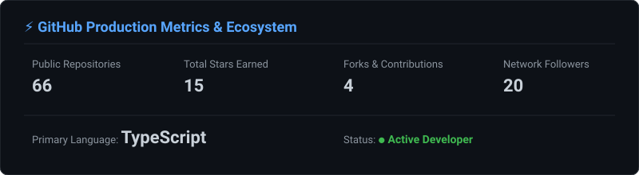
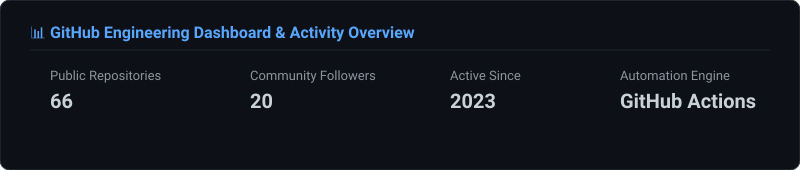

 

Engineering web applications, building AI tools, and shipping practical software — transforming ideas into production-ready products.

 

  

---

## ⚡ About / Engineering Focus

Full-stack engineer focused on building scalable web applications, practical AI/ML tools, robust backend architecture, and developer tooling with production deployment automation.

---

## ⚙️ What I Build

 

<table width="100%">
  <tr>
    <td width="50%" valign="top">
      <h4>01 — Web Products</h4>
      
Production-ready full-stack applications built for speed and scale.

    </td>
    <td width="50%" valign="top">
      <h4>02 — AI Systems</h4>
      
Practical AI tools, automation, and intelligent workflows.

    </td>
  </tr>
  <tr>
    <td width="50%" valign="top">
      <h4>03 — Developer Tools</h4>
      
Internal tools, automation, APIs, and engineering utilities.

    </td>
    <td width="50%" valign="top">
      <h4>04 — Experiments</h4>
      
Prototypes, systems experiments, game mechanics, and emerging tech.

    </td>
  </tr>
</table>

 

---

## 🧰 Tech Stack

 

| Category | Action-Driven Stack & Tooling |
| :--- | :--- |
| **Frontend** | React · Next.js · JavaScript · TypeScript · Tailwind CSS |
| **Backend** | Node.js · Express · Flask · Django · FastAPI |
| **Databases** | PostgreSQL · MongoDB · Redis · Firebase |
| **Languages** | JavaScript · TypeScript · Python · Java |
| **DevOps & Infra** | Git · GitHub · Docker · Linux · Azure · GitHub Actions |

 

---

## 🚀 Featured Production Work

### Titanium Fest Platform
*Architecting an event platform built to sustain high-volume real-world traffic.*

* **Handling traffic**: Served 13K+ active users & 41K+ unique visitors
* **Ensuring reliability**: Sustained 100% uptime with zero downtime
* **Leading execution**: Directed full-stack development, GitHub Actions CI/CD automation, and cloud deployment

 

### AI Projects
*Deploying practical AI products that automate and streamline complex workflows.*

* **Automating workflows**: Engineering GitHub Actions CI/CD pipelines, AI video editing workflows, intelligent media pipelines & developer tooling
* **Focusing on utility**: Solving concrete workflow bottlenecks through practical AI and AI-powered workflow systems

---

## 📈 Automated Production Metrics

---

## 🏆 Achievements

* **Winner** — Circuity Hackathon 2024 (1st place in state hackathon)
* **Top 6** — BuzzOnEarth / IIT Kanpur national finals
* **10+ Hackathon Participation** — Multi-platform experience & prototyping
* **Production Platform Development** — Directed full-stack architecture & deployment for Titanium Fest

 

---

## 📊 GitHub Statistics

  

---

## 🧊 GitHub Contribution Visualization

---

## ✦ Currently Building

Actively pushing code & shipping updates for [Final-year-project](https://github.com/SriSanjana005/Final-year-project), [Paytm-AI-Hackathon](https://github.com/SivaSabariGanesan/Paytm-AI-Hackathon).

---

## ☕ Engineering Principles

* Build before overthinking.
* Turn ideas into working software.
* Optimize for real users.
* Prefer simple systems that scale.
* Learn by shipping.

---

## 📊 GitHub Activity

---

### **Let's build something useful.**

 

  

  

