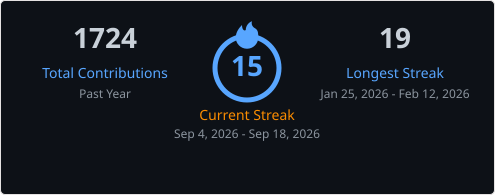
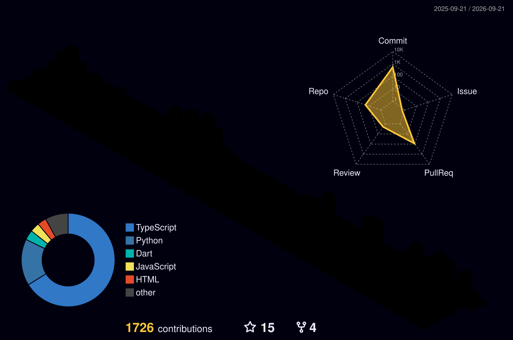

 

### 👨‍💻 Full-Stack Developer

I build **web applications, developer tools, and experimental products** — from turning an idea into a prototype to shipping something people can actually use.

I enjoy working across the stack, solving messy problems, and learning whatever the project demands.

 

---

## ⚡ What I Do

 

* **🌐 Full-Stack Development** — Building scalable and production-ready web applications.
* **🧠 AI & Experimental Products** — Exploring practical ways to turn AI into useful tools.
* **🎨 Frontend Engineering** — Building fast, interactive and thoughtful interfaces.
* **🚀 Product Building** — Taking ideas from "what if?" to working product.

 

---

## 🛠️ Tech Stack

### Frontend

  

### Backend & Database

  

### Languages

  

---

## 🚀 Things I've Built

### 🏟️ Titanium Fest

An event platform built to handle real-world traffic at scale.

* **13K+ users**
* **41K+ unique visitors**
* Zero downtime during the event
* Led website development and deployment

### 🧠 AI Projects

Currently experimenting with AI-powered products focused on solving real problems rather than using AI for the sake of AI.

### 🏆 Hackathons

* 🥇 **Winner — Circuity 2024**, Saveetha Engineering College
* 🏅 **Top 6 — BuzzOnEarth**, IIT Kanpur

---

## 📊 GitHub Activity

  

---

## 🏆 Achievements

---

## 🧊 Contribution Graph

---

## 🎯 Currently

* Building full-stack applications
* Exploring AI-powered products
* Experimenting with game development
* Participating in hackathons
* Learning something new whenever I can

---

## ☕ A Few Things About Me

* I like building more than talking about building.
* I enjoy turning vague ideas into working software.
* I have an unhealthy relationship with `git commit`.
* Coffee is occasionally a dependency.

---

### Let's build something interesting.

 

  

